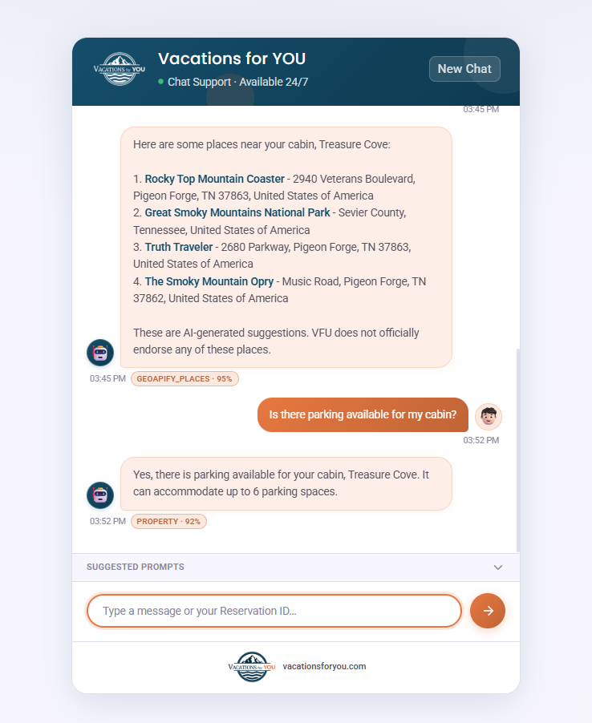

# Vacations for YOU — RAG Tool-Agent Chatbot

A Spring Boot application that powers a **branded web chat** for **Vacations for YOU** rental support. Guests ask questions in natural language; an **OpenAI** model (via **Spring AI**) decides when to call **tools** for policies, reservations, property details, and nearby places. Answers are grounded in **RAG** (vector search over policy documents) and **read-only** integrations where verification is required.

---

## UI preview

The chat experience is served from `src/main/resources/static/` (e.g. `/` and `/index.html`). Below is a **representative preview** of the layout and branding (colors, header, bubbles, input area).

<div align="center">
  
</div>

The live page also persists the on-screen transcript in the browser using **`localStorage`** (`vacationsChatTranscript`) so a refresh does not clear the visible conversation. Use **Reset** in the header to clear it and the server session id hint.

---

## What this project does

| Area | Behavior |
|------|----------|
| **Policy Q&A** | Retrieves relevant chunks from embedded policy documents stored in **PostgreSQL + pgvector** (similarity search). |
| **Reservations** | After the guest provides a **6-digit confirmation ID** and **last name**, the backend verifies and loads reservation data via **StreamX**. |
| **Property details** | For a **verified** session, returns unit/property fields (e.g. Wi‑Fi, amenities, coordinates) from StreamX, without asking again for IDs the session already holds. |
| **Nearby places** | Uses **Geoapify** around the property coordinates (within ~10 miles), with category hints such as restaurants, grocery, or pharmacy. |
| **Safety & quality** | Rate limiting (Resilience4j), structured **confidence** and **source** parsing, optional LLM-as-judge, analytics logging, Prometheus metrics, and escalation when confidence is too low. |

The frontend calls **`POST /api/chat`** with JSON `{ "message", "sessionId" }` and reads the session id from the **`X-Session-ID`** response header when present.

---

## Agent tools (Spring AI `@Tool`)

These methods live in `ChatBotTools.java` and are exposed to the model as tools:

| Tool | Purpose |
|------|---------|
| **`policy_rag_tool`** | **`policy_rag_tool(userQuestion)`** — Vector similarity search over policy documents (pgvector). Used for general policy questions (check-in rules, pets, cancellations, etc.). |
| **`reservation_info_tool`** | **`reservation_info_tool(confirmationId, lastName)`** — Verifies the guest and returns reservation details from StreamX. `confirmationId` must be **6 digits**. |
| **`property_info_tool`** | **`property_info_tool()`** — Returns property/unit details for the **verified** session (unit id comes from session; orchestrated through `StreamXOrchestrator`). |
| **`nearby_places_tool`** | **`nearby_places_tool(categoryHint)`** — Geoapify places near the property. Optional hint: e.g. `restaurants`, `grocery`, `pharmacy`, or empty for default attractions/sights/parks. Requires coordinates on the session (typically after property resolution). |

Tool selection and guardrails are further constrained by the system prompt in `OpenAiConfig.java` (verification rules, mandatory response format, confidence/source labels, etc.).

---

## Tech stack

- **Java 17**, **Spring Boot 4.x**
- **Spring AI** (OpenAI chat + embeddings, RAG, `@Tool` calling)
- **PostgreSQL** with **pgvector** (vector store + JPA)
- **StreamX** API (reservations / properties)
- **Geoapify** (nearby POIs)
- **Resilience4j** (rate limiter), **Micrometer** + **Prometheus**, **Grafana** (via Docker Compose)
- Static **HTML / CSS / JS** chat UI

---

## Configuration (environment variables)

Set these (see `application.yml`):

| Variable | Used for |
|----------|----------|
| `OPENAI_API_KEY` | OpenAI API |
| `DATABASE_URL`, `SPRING_DATASOURCE_USERNAME`, `SPRING_DATASOURCE_PASSWORD` | PostgreSQL |
| `STREAMX_URL`, `STREAMX_KEY`, `STREAMX_SECRET` | StreamX integration |
| `GEOAPIFY_URL`, `GEOAPIFY_TOKEN` | Geoapify Places |
| `CUSTOMER_SUPPORT_PHONE`, `CUSTOMER_SUPPORT_EMAIL` | Configurable support contact strings |

### StreamX API and IP allowlisting

StreamX only accepts traffic from **allowlisted IP addresses**. For **each deployment target** (cloud region, on-prem host, container platform, etc.), obtain the **public outbound IP** that your application will use when calling StreamX, then **coordinate with Vacations for YOU** to have that address added to StreamX’s allowlist. Reservation and property features depend on StreamX; calls will fail until the deployment IP is approved.

---

## Run locally

**Database:** Use a PostgreSQL instance with the **pgvector** extension (schema can be initialized by Spring AI as configured).

**Start the app** (example):

```bash
./mvnw spring-boot:run
```

Or use **Docker Compose** (app + Postgres + Prometheus + Grafana):

```bash
docker compose up --build
```

Default app port in Compose: **8080**. Open **http://localhost:8080/** for the chat UI.

- Actuator/metrics (exposed per `application.yml`): e.g. health, Prometheus scrape endpoint.
- Development-specific settings may live under `application-dev.yml` and profile `dev`.

---

## Security note

`SecurityConfig` permits public access to the static UI and API routes required for the chat (e.g. `/`, `/*.css`, `/images/**`, `/api/**`). Adjust for production (authentication, CSRF, CORS origins) as needed.

---

## License / attribution

This repository is a **Capstone project** developed for **Vacations for YOU**. It implements a Vacations for YOU–style support chatbot; branding and copy should stay aligned with the client’s official site and policies.
